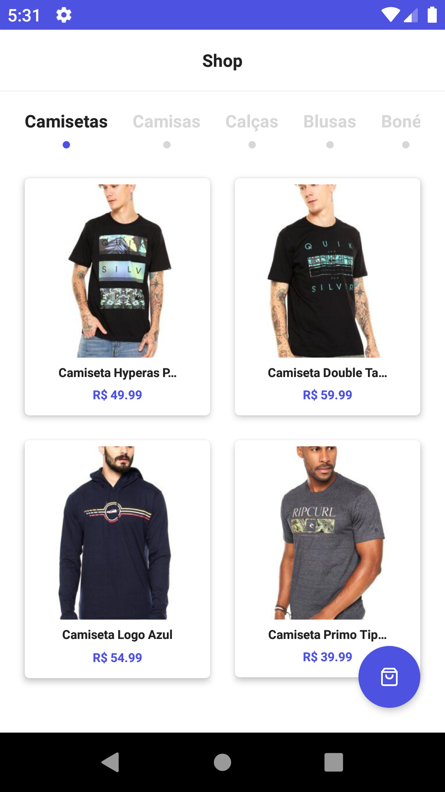
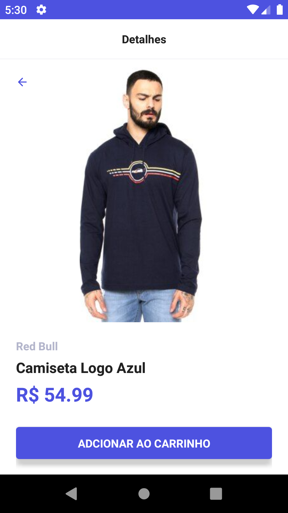
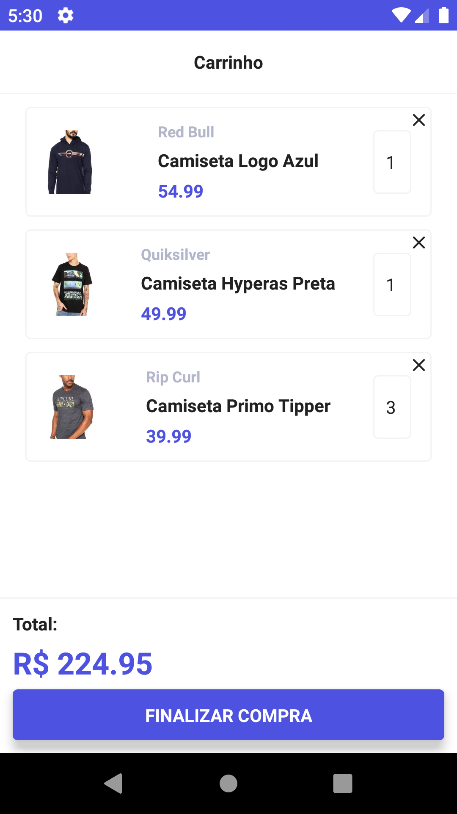

# Lore

#### Aplicativo ecommerce usando uma json-api com React Native

## Como rodar o projeto :

Antes de iniciar o projeto certifique de [possuir o setup para trabalhar com react-native](https://facebook.github.io/react-native/docs/getting-started) e o json-server
intalado em sua maqui de forma global.

- Clone o projeto:

  > git clone https://github.com/antunesgabriel/lore-app.git

- Entre na pasta do projeto :
  > cd lore-app
- Inicie o servidor json :
  > json-server ./server.json
- Instale as dependências :
  > npm i ou yarn
- Rode em algum emulador :
  > yarn run android ou yarn run ios
- Logo após a instalação rode o metro bundle
  > yarn start ou npm start

## Screenshots:

